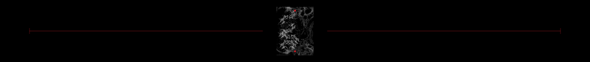
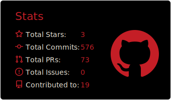
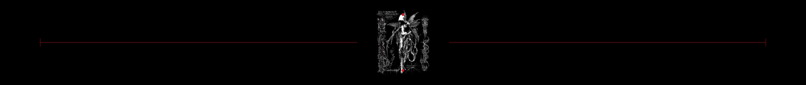

<!--
  ============================================================================
  MAXIMILIAN WIKSTRÖM — github profile
  ============================================================================
  Cyber-sigilism design system, ported from the Tessera project:
    ink ground · bone text · blood accents · monospace voice
  Sigils embedded in banner.svg (hero) + banner-1..5.svg (section breaks).
  ============================================================================
-->

<p align="center">
  
</p>

<p align="center">
  <a href="https://max-wik.com/"></a>
  <a href="https://maximilian-wikstrom.vercel.app/"></a>
  <a href="https://www.linkedin.com/in/maximilian-wikström/"></a>
  <a href="https://www.instagram.com/max_wik/"></a>
  
</p>

<br>

```
┌─ MANIFEST ──────────────────────────────────────────────────────────────────┐
│                                                                             │
│   I build small, opinionated web things — and the occasional desktop        │
│   oddity. React, TypeScript, Cloudflare Workers, Hono, Python, numpy.       │
│                                                                             │
│   Currently obsessed with: things that outlast their author. QR codes       │
│   verified against the ISO spec. State-switch architectures. DSP that       │
│   stays deterministic forever. Portfolios that load in under a second       │
│   on a phone in a basement.                                                 │
│                                                                             │
│   Based in Stockholm. Open to interesting work.                             │
│                                                                             │
└─────────────────────────────────────────────────────────────────────────────┘
```

<p align="center"></p>

## ◆ ARTIFACTS

<table width="100%" cellspacing="0" cellpadding="0">
<tr><td valign="top" width="50%">

### [tessera](https://github.com/MaximilianWik/Tessera)
*verified-permanent QR codes*

A QR generator built for codes that get tattooed and must work for life. Encoder verified bit-for-bit against the **ISO/IEC 18004 Annex I** worked example. Every output round-tripped through three independent decoders (jsQR, zxing-js, native `BarcodeDetector`). Damage-tolerance simulated with progressive Gaussian blur. Printable archival spec sheet with full module matrix as ASCII + hex dump.

`Vanilla JS` · `Reed-Solomon` · `GF(256)` · `93 tests in CI`

**→ [live](https://tessera-neon.vercel.app/) · [tests](https://tessera-neon.vercel.app/tests.html)**

</td><td valign="top" width="50%">

### [subdermal](https://github.com/MaximilianWik/Subdermal) `// max-wik.com`
*the page behind a tattooed QR*

A React SPA on **Cloudflare Workers + Hono + D1**, with a state-switch architecture: a single number in `state.ts` selects what the page renders. State 8 is a 16,384 × 24,576 collaborative canvas — nine brushes, pinch-zoom, draft auto-save, per-browser ownership in D1, admin-token-gated moderation.

`React 19` · `Hono 4` · `Cloudflare D1` · `edge SQLite`

**→ [live](https://max-wik.com/)**

</td></tr>

<tr><td valign="top" width="50%">

### [cursed-echoes](https://github.com/MaximilianWik/CursedEchoesMiniGame)
*a gothic typing trial*

Browser typing game, Dark-Souls aesthetic. Four zones, three bosses, parry system, dodge-roll i-frames. **Three HiDPI canvases**, game state in refs (HUD ticks at 10 Hz, no per-keystroke React renders). All audio synthesized via Web Audio on demand — cathedral reverb bus, dissonant tritone drones per zone, inharmonic bell partials.

`React` · `HTML5 Canvas` · `Web Audio API`

**→ [live](https://cursedechoes.vercel.app/)**

</td><td valign="top" width="50%">

### [carpet-eater](https://github.com/MaximilianWik/Carpet-Eater)
*a desktop mouth that chews audio*

Frameless, transparent, mouth-shaped Windows app for the artist [Carpet Eater](https://soundcloud.com/carpet_eater). Drag any audio file onto it — it chews and spits a mangled version next to the original. Five DSP chains, nine pure-numpy stages, deterministic from a SHA-1 of the input file (same input → same output, forever). PyInstaller + Inno Setup, GitHub Actions CI builds EXE + installer + portable on every push.

`Python` · `PySide6` · `numpy DSP` · `ffmpeg`

</td></tr>

<tr><td valign="top" width="50%">

### [studio-panic-attack](https://github.com/MaximilianWik/Studio-Panic-Attack)
*3D scroll-driven portfolio for a designer*

Built (pro bono) for designer Ema Stoyanova. **`@react-three/fiber` + Three.js r180**, custom GLSL shaders (halftone, dither, paper, glass, metal), GSAP scroll-synced timelines. GPU-tier-adaptive: tier ≤ 1 devices get particles halved, postprocessing dropped, transmission swapped. Custom asset pipeline: 857 MB raw → ~70 MB WebP + 14 MB AVIF + LQIP placeholders.

`R3F` · `Three.js` · `GLSL` · `WebGL`

**→ [live](https://studio-panic-attack-maximilian.vercel.app/)**

</td><td valign="top" width="50%">

### [portfolio](https://github.com/MaximilianWik/PortfolioV3)
*dark-fantasy-formal personal site*

React 19 · Vite 6 · Tailwind 4 · `motion/react`. Ember-blood on ink-void, ceremonial typography, bonfire-lit hero. Heavy sections code-split via `React.lazy`. `DispersingText` runs a single `pointermove` listener + single RAF loop for the whole paragraph. JSON-LD Person + WebSite schemas for Knowledge Graph signals.

`React 19` · `Vite 6` · `Tailwind 4` · `motion`

**→ [live](https://maximilian-wikstrom.vercel.app/)**

</td></tr>
</table>

<p align="center"></p>

## ◆ STACK

```
┌─ PRIMARY ──────────────────────────────────────────────────────────────┐
│  TypeScript    React    Vite    Hono    Cloudflare Workers    Tailwind │
└────────────────────────────────────────────────────────────────────────┘
┌─ ALSO COMFORTABLE WITH ────────────────────────────────────────────────┐
│  Python    numpy    PySide6/Qt    Three.js / R3F    GLSL    Node       │
│  D1 / SQLite    Postgres    Vercel    GitHub Actions    Playwright     │
└────────────────────────────────────────────────────────────────────────┘
```

<p>
  
</p>

<p align="center"></p>

## ◆ TELEMETRY

<!-- Live counters via shields.io — bulletproof, always up -->
<p align="center">
  
  
  
  
</p>

<!--
  Static stats card — generated daily by .github/workflows/profile-summary-cards.yml
  and recolored to the Tessera palette in the same workflow.
-->
<p align="center">
  
</p>

<!-- Activity graph — different Vercel deployment from the paused stats one -->
<p align="center">
  
</p>

<!-- Snake animation. Generated daily by .github/workflows/snake.yml -->
<p align="center">
  <picture>
    <source media="(prefers-color-scheme: dark)" srcset="https://raw.githubusercontent.com/MaximilianWik/MaximilianWik/output/snake.svg">
    <source media="(prefers-color-scheme: light)" srcset="https://raw.githubusercontent.com/MaximilianWik/MaximilianWik/output/snake-light.svg">
    
  </picture>
</p>

<p align="center"></p>

## ◆ TRANSMISSION

```
$ contact --priority high
  ↳ max.wik@icloud.com
  ↳ +46 70 736 05 15
  ↳ stockholm, se
  ↳ open to: senior frontend · full-stack · creative engineering
```

<p align="center"></p>

<p align="center">
  <sub><code>// EOF — built with care, on a ground of ink, in a font of bone, with one drop of blood.</code></sub>
</p>
